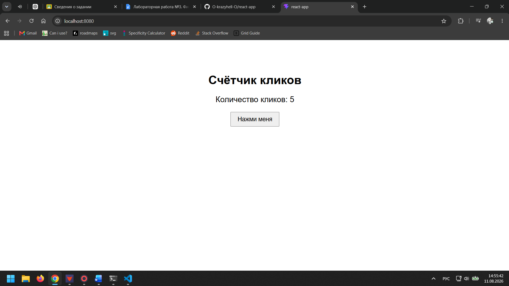

# React Click Counter

Простое React-приложение, разработанное с использованием **React** и **Vite**.
Приложение представляет собой счётчик кликов: при нажатии на кнопку текущее количество кликов увеличивается на единицу.

Проект предназначен для демонстрации сборки React-приложения с использованием **Docker** и многоступенчатого Dockerfile.

## Используемые технологии

* React
* Vite
* JavaScript
* Docker
* Nginx

## Структура проекта

```text
react-docker-app/
├── public/
├── src/
│   ├── App.jsx
│   ├── App.css
│   ├── index.css
│   └── main.jsx
├── .dockerignore
├── .gitignore
├── Dockerfile
├── index.html
├── package-lock.json
├── package.json
└── vite.config.js
```

## Запуск приложения локально

Для запуска проекта в режиме разработки необходимо установить зависимости:

```bash
npm install
```

После этого запустить Vite:

```bash
npm run dev
```

Приложение будет доступно по адресу:

```text
http://localhost:5173
```

## Сборка Docker-образа

Для создания Docker-образа необходимо выполнить команду в корневой директории проекта:

```bash
docker build -t react-docker-app .
```

В процессе сборки используется многоступенчатый Dockerfile.

На первом этапе выполняется установка зависимостей и production-сборка React-приложения с помощью Vite:

```bash
npm ci
npm run build
```

Результат сборки помещается в директорию `dist`.

На втором этапе используется Nginx, в который копируются собранные файлы приложения.

## Запуск Docker-контейнера

Для запуска контейнера необходимо выполнить:

```bash
docker run -d -p 8080:80 --name react-docker-app-container react-docker-app
```

После запуска приложение будет доступно по адресу:

```text
http://localhost:8080
```

## Скриншот работающего приложения



## Управление контейнером

Просмотр запущенных контейнеров:

```bash
docker ps
```

Остановка контейнера:

```bash
docker stop react-docker-app-container
```

Удаление контейнера:

```bash
docker rm react-docker-app-container
```

## Dockerfile

Проект использует многоступенчатую сборку:

1. На первом этапе используется образ Node.js для установки зависимостей и сборки React-приложения.
2. На втором этапе используется Nginx для запуска готовой production-версии приложения.

Такой подход позволяет не включать исходный код и зависимости Node.js в финальный production-образ.
